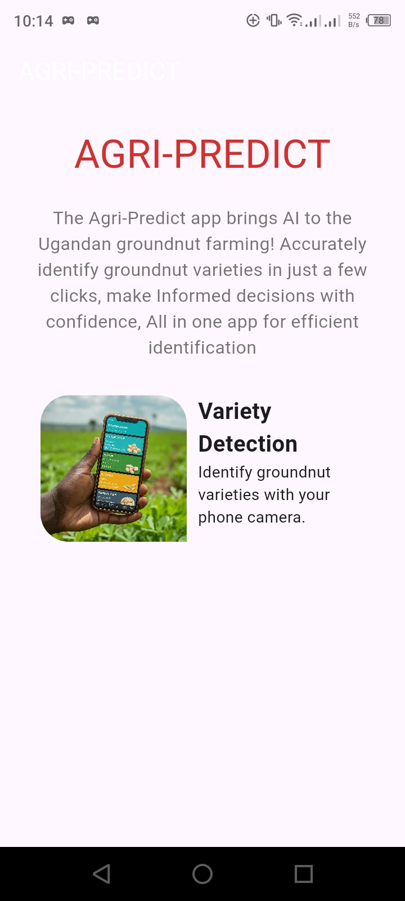
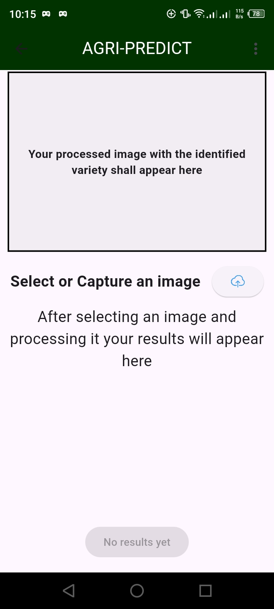
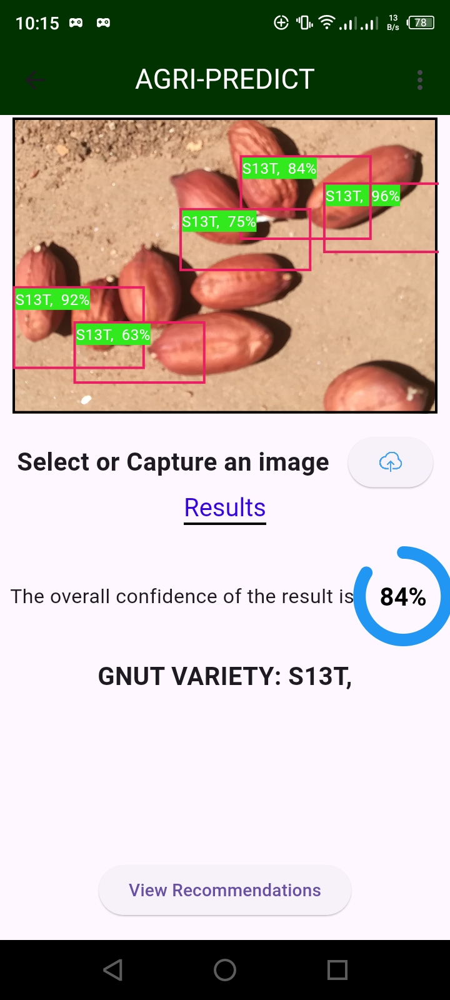

# Agri-Predict App

## Overview
Agri-Predict is a mobile application developed in Flutter that helps farmers identify groundnut varieties automatically. This app aims to reduce the reliance on manual identification methods, which can be expensive and time-consuming due to the need for hiring experts. The app leverages image processing and machine learning to provide quick and accurate identification of groundnut varieties.

## Features
- **Groundnut Variety Identification**: Automatically identify different varieties of groundnuts using images.
- **Image Capture**: Capture images using the camera or select from the gallery.
- **User-Friendly Interface**: Simple and intuitive interface designed for ease of use by farmers.
- **Offline Support**: Ability to work in offline mode, ensuring functionality even without internet access.
- **Result Display**: Display processed images and identification results within the app.

## Screenshots

  
  
  

## Technologies Used
- **Flutter**: For building the cross-platform mobile application.
- **Dart**: Programming language used in Flutter.
- **Firebase**: Backend for storing data and authentication.
- **Image Processing**: Techniques for processing images to identify groundnut varieties.

